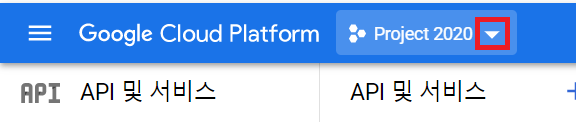
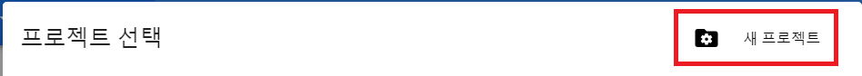
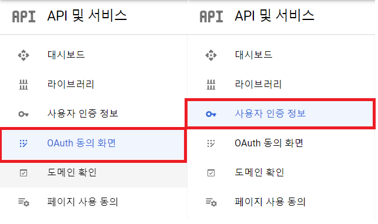
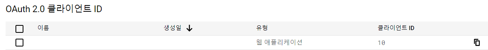
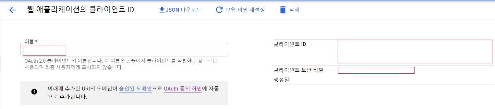

# Spring-Security-OAuth
1. **Basic knowledge of Spring Security**
2. **Project using Spring Security, OAuth2 Client**

-----------------

## Contents
1. [Using](#using)
2. [Project Dependency](#project-dependency)
3. [OAuth2 Client Provider](#oauth2-client-provider)
4. [OAuth API 설정 순서](#oauth-api-설정-순서)
5. [Security Session](#security-session)
6. [PrincipalDetails를 만든 목적](#principaldetails를-만든-목적)
7. [Licence](#license)

--------------------------------------------

## Using
1. **FrontEnd** - HTML5
2. **BackEnd** - Java(JDK 1.8), MySQL(v8.0.25), Spring Boot(2.3.12.RELEASE), JPA
3. **Library&API** - Spring Security, Lombok, Mustache, Google API, OAuth2 Client
4. **IDE** - STS (Spring Tool Suite 3.9.12.RELEASE), MySQL Workbench 8.0 CE

--------------------------------------------

## Project Dependency
1. **Spring Boot DevTools** : Hot reloading, 소스파일을 수정했을 때 저장하면 프로젝트가 자동으로 리로딩이 됨.
2. **Lombok** : Getter, Setter, 생성자, Builder 패턴을 위해 사용
3. **Spinrg Data JPA** : ORM 쓰기 위해 사용
4. **MySQL Driver** : MySQL DB 사용
5. **Spring Security** : 우리 서버로 들어오는 모든 주소가 막혀서 인증이 필요한 서버가 된다.
6. **Mustache** : Template Engine / 스프링에서 공식적으로 사용 권장
    - mustache : 기본 폴더가 src/main/resoureces/
    - 뷰 리졸버 설정 : templates (prefix), .mustache (suffix)
    - 예를 들어, src/main/resources/templates/index.mustache
    - Mustache를 사용하겠다고 의존성 설정을 하면 자동으로 뷰 리졸버가 설정됨. 뷰 리졸버를 yml, properties 파일에 설정할 필요 없음
    - .html을 사용하기 위해서 config/WebMvcConfig.java 에서 Mustache 재설정
7. **Spring Web** : Web과 관련된 Annotation
8. **Oauth2 Client** : **로그인 완료시** 승인 코드만 받는 것이 아니라, **엑세스 토큰+사용자 프로필 정보까지 한번에 받는다.**
    - **구글 예시**
        1. 구글 로그인 버튼 클릭
        2. 구글 로그인 창
        3. 로그인을 완료
        4. 승인 코드를 리턴 받음
        5. 코드를 보고 OAuth-Client 라이브러리가 AccessToken 요청
        6. userRequest 정보를 받음. 이때, loadUser 함수 호출
        7. 구글로부터 회원 프로필을 받아준다.

--------------------------------------------

## OAuth2 Client Provider
- **OAuth2 Client Provider** : **OAuth2 Client 를 제공해주는 제공자**
    - Spring은 google, facebook, twitter, ... 등을 기본으로 제공해준다.
    - 네이버나 카카오는 기본 제공자에 없다.
    - 그 이유는 포털 사이트들 마다 OAuth를 사용할 때 **getAttribute가 리턴해주는 값이 너무 다양**하기 때문
    - 기본 제공자가 아닌 경우 application.yml에 provider를 등록해주어야 한다.
    
--------------------------------------------

## OAuth API 설정 순서
1. **Google**
    1. [Google API Developer Console](https://console.cloud.google.com/apis)
    2. 새 프로젝트 생성 (생성 완료 후 선택)
        - 프로젝트 이름 설정
        - 완료
    3. **OAuth 동의 화면 구성**
        - **User Type** : **외부**
        - 애플리케이션 이름 설정
        - 이메일 설정
        - 완료
    4. **사용자 인증 정보**
        1. **사용자 인증 정보 만들기** - **OAuth 클라이언트 ID** 선택
        2. **애플리케이션 유형** - **웹 애플리케이션**
        3. 이름 설정
        4. **승인된 리다이렉션 URI** 설정 - http://localhost:8090/login/oauth2/code/google
            - 구글 로그인을 완료했을 때 승인 코드를 돌려받는 주소
            - **OAuth Client 라이브러리 사용 시 포트번호 이후 URI는 고정값**
            - 컨트롤러에 만들 필요 X, 라이브러리가 알아서 처리해준다.
        5. 완료
    5. OAuth **클라이언트 ID**, **클라이언트 보안 비밀번호** - application.yml 에서 사용
    6. 참고 이미지
        <p align="center">
            
        </p>
        <p align="center">
            
        </p>
        <p align="center">
            
        </p>
        <p align="center">
            
        </p>
        <p align="center">
            
        </p>
2. **Facebook**
    1. [Facebook API Console](https://developers.facebook.com/)
    2. 내 앱 -> 앱 만들기(기타 또는 없음 선택)
    3. 제품 추가 -> Facebook 로그인 -> 웹
        - **사이트 URL** : http://localhost:8090
        - 완료
    4. 설정 -> 기본 설정
        - 앱 ID, 앱 시크릿 코드 확인 후 application.yml 에서 사용
3. **Naver**
    1. [네이버 개발자 센터](https://developers.naver.com/main/)
    2. Application -> 애플리케이션 등록 (API 이용신청)
        - 애플리케이션 이름 설정
        - **사용 API** : 네아로 (네이버 아이디로 로그인)
        - **회원이름, 이메일 주소** 필수 선택
        - 로그인 오픈 API 서비스 환경 : 환경 추가 (PC 웹)
            - **서비스 UR**L : http://localhost:8090
            - **Callback URL** : http://localhost:8090/login/oauth2/code/naver
            - **Callback URL** 은 **applicaiton**.**yml**에 작성한 **redirect**-**uri** 와 같아야 한다.
        - 완료
    3. 애플리케이션 정보에 Client ID와 Client Secret 확인 후 application.yml 에서 사용
    4. **네이버는 기본 제공자가 아니기 때문에 application.yml 에 provider 를 등록해주어야 한다.** [개발 가이드 참고](https://developers.naver.com/docs/login/devguide/devguide.md)
    
--------------------------------------------

## Security Session
1. **Security Session**
    - **서버가 가지고 있는 Session 영역 안에 Security가 관리하는 Security Session 영역이 따로 있음.**
    - **Security Session 안에 들어갈 수 있는 타입은 Authentication 객체**
    - 필요할 때마다 Controller에서 Authentication 를 DI해서 사용할 수 있다.
2. **Authentication**
    - **Authentication 안에 들어갈 수 있는 객체**
        1. **UserDetails 타입** - **일반적인 로그인**을 하면 UserDetails 타입으로 들어간다.
        2. **OAuth2User 타입** - **OAuth 로그인**을 하면 OAuth2User 타입으로 들어간다.
3. **Controller 에서 사용할 때**
    1. **UserDetails** : @AuthenticationPrincipal PrincipalDetails principalDetails
    2. **OAuth2User** : @AuthenticationPrincipal OAuth2User oauth
    3. **두 개의 메소드가 필요해진다.**
4. **두가지를 한번에 처리하는 방법**
    - **UserDetails와 OAuth2User를 둘 다 implements 하는 클래스를 사용**
        ```java
        public class PrincipalDetails implements UserDetails, OAuth2User
        ```

--------------------------------------------

## PrincipalDetails를 만든 목적
- **Security Session** 안에 있는 **Authentication** 객체 안에 담을 수 있는 객체 타입
    1. **OAuth2User**
    2. **UserDetails**
- **로그인을 하게 되면 User 오브젝트가 필요하다. 그러나 OAuth2User와 UserDetails는 User 오브젝트를 포함하지 않는다. 즉, 세션을 읽어도 User를 찾을 수 없다.**
- **해결 방법**
    1. PrincipalDetails를 **UserDetails 와 OAuth2User 를 implements** 해서 생성한다.
    2. **PrincipalDetails 안에 User 오브젝트를 집어넣는다.**
- 이렇게 하면 UserDetails 와 OAuth2User 를 PrincipalDetails **하나로 대체**하여 세션에 접근하면 **User 오브젝트에 접근**할 수 있다.

--------------------------------------------

## License
- **Source Code** based on [codingspecialist'lecture](https://github.com/codingspecialist)